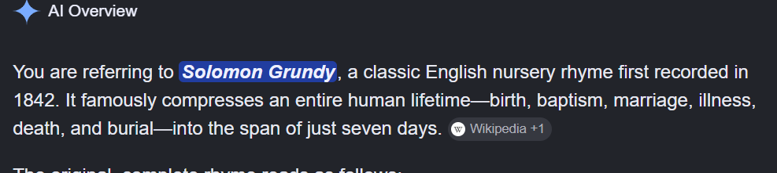
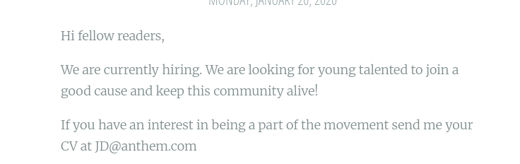
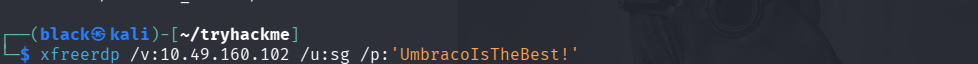
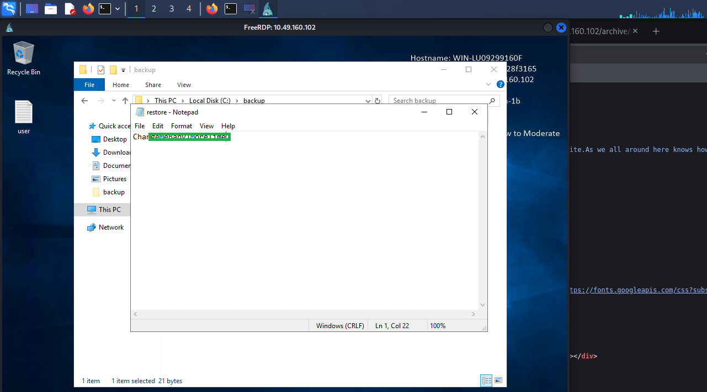
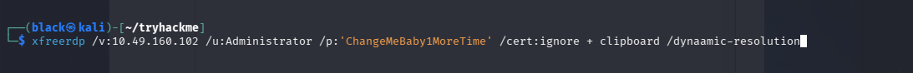

# TryHackMe - Anthem Writeup


## Room Information
*Exploit a Windows machine in this beginner level challenge.

## Objective

The objective of this room was to perform reconnaissance, enumerate services, discover credentials, and gain access to the target machine.

---

## Task 1: Reconnaissance

## What port is for the web server?

## What port is for remote desktop service?

### Nmap Scan

I started by scanning the target machine to identify open ports and running services.

Command used:

```bash
nmap -Pn 10.49.160.102
```

### Results


The scan revealed a web server running on port 80 and Remote Desktop Protocol on port 3389.

---

### Task 2: Web Enumeration

## What is a possible password in one of the pages web crawlers check for?

## What CMS is the website using? 

## Robots.txt Analysis

I request the robots.txt file from the web server at 10.49.160.102 and display its contents in the terminal

Command Used:
   ~ curl -s http://10.49.160.102/robots.txt ~ 

## Results 


###  Task 3: Web Inspection

## What is the domain of the website?

I accesed  the website at ~ http://10.49.160.102 ~ and viewed the pages

## Results 


### Task 4: Credential Discovery

  ## What's the name of the Administrator

  ## Results 

  On investigating we foung out some information where we could get the admin  name's

  

  So using the above information we on to web and search for them and found the admin's name 

  

  ## Can we find find the email address of the administrator?

  Using the information from the website we found out that the email of users are in this form 
  ( Jane  Doe , the email will be JD@anthem.com) so using the admin's name we found his email

  

  

### Task 5: Flg  Collection

  Here the task was to find flag1, flag2 and flag 3 which were left by the admin 

  ##  Flag 1

  For flag one  I inspected the website by viewing the page source of the website 

  

  ##  Flag  2

  For  the second  flag I went further on inspecting the page source of the website and I found the  website 

  

  ## Flag 3 

  For the third  flag  I was supposed to find it on one of the profiles of the website that is Jane Doe's profile 

  

  ## Flag  4

  Flag 4 was a bit diffent since you were to change the web pages and view their page source to find the flag

  


### Task 6 :  Remote  Access 

  ## Gain initial access to the machine, what is the contents of user.txt?

  Using the discovered credentials, I connected to the target through Remote Desktop Protocol (RDP).

Command used: 

  xfreerdp /v:10.49.160.102  /u:sg /p:UmbracoIsTheBest! 

  

  ## Results 

   After I gained access of the machine, I searched for the user.txt file and found the flag 


   

## Can we spot the admin password?

Now this one required one to first find the hidden file and then change the permision of that file so as the 'solomon' could
also acces it since the restore.txt file was only accesed by the admin

  ## Results 
  


## Escalate your privileges to root, what is the contents of root.txt?

  Using the  admin password we got from restore.txt file I was able to escalate m privilages to admins 

Command used :

  xfeerdp /v:10.49.160.102 /u:administrator /p:ChangeMeBaby1MoreTime /cert:ignore +clipboard /dynamic-resolution

  

## Results 

  I gained access to the system as an administrator , hence i was able to read the contents of root.txt

  

## Lessons Learned

* Importance of reconnaissance
* Service enumeration techniques
* Discovering credentials from publicly accessible information
* Basic RDP access and navigation
* Flag hunting methodology

## Conclusion

This room demonstrated the importance of careful enumeration and how seemingly small pieces of information can lead to full system access.
