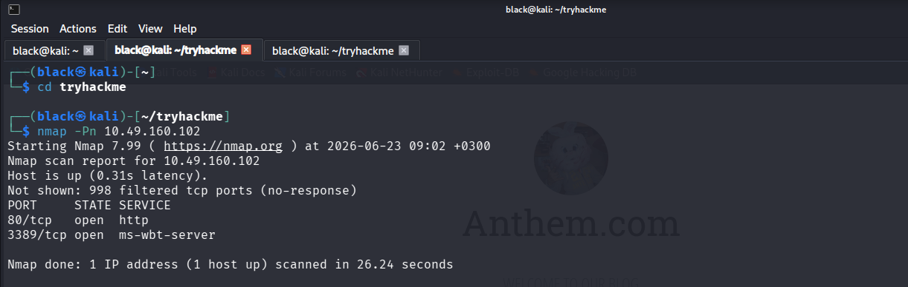
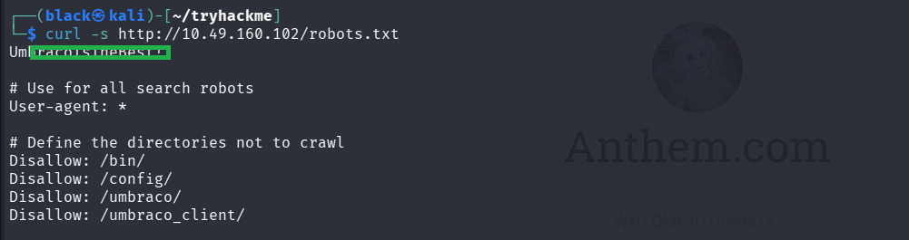
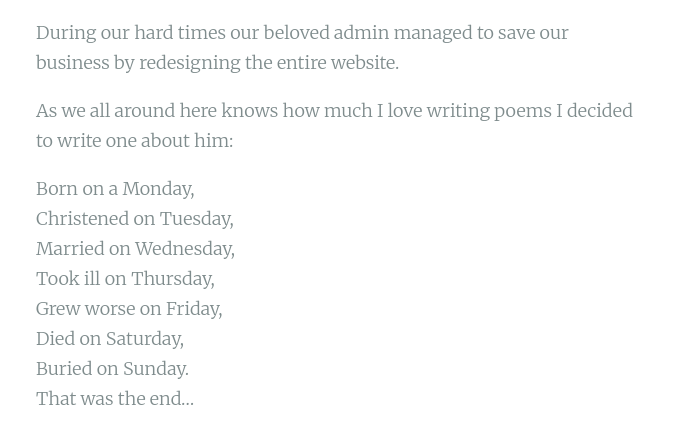
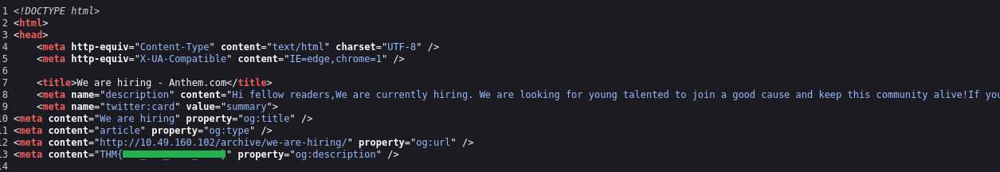
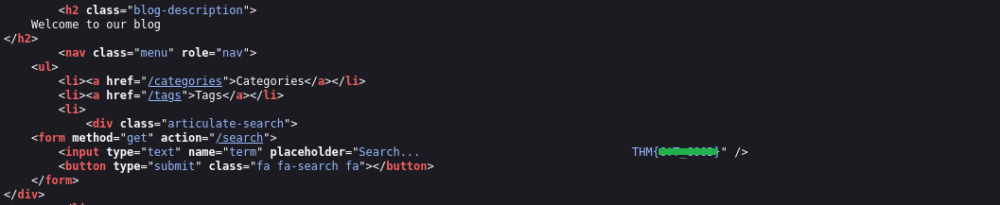
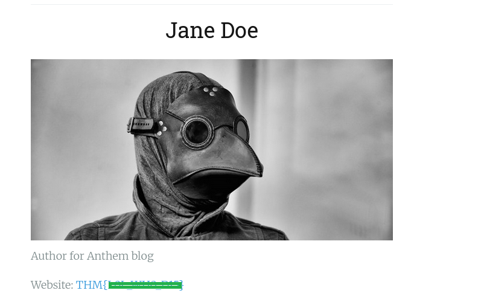
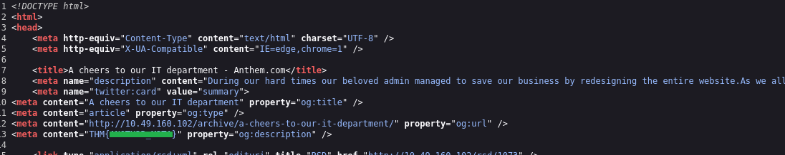
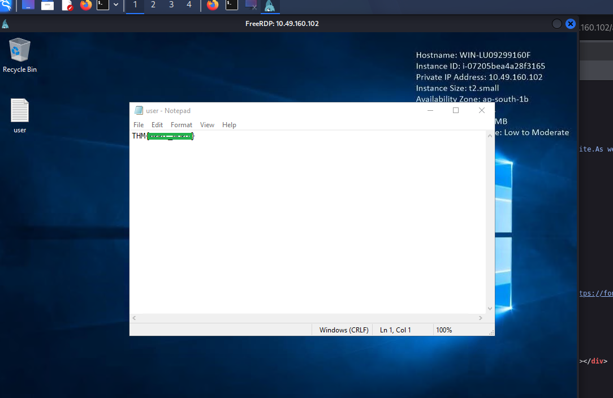
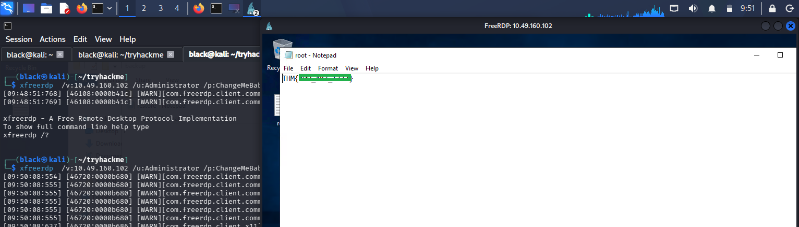

# TryHackMe - Anthem Writeup

## Room Information

Anthem is a beginner-level TryHackMe Windows machine focused on web enumeration, credential discovery, and basic privilege escalation.

---

## Objective

The objective of this room was to perform reconnaissance, enumerate services, discover credentials, and gain access to the target machine, followed by privilege escalation to obtain the root flag.

---

## Tools Used

* Nmap
* Curl
* Web browser
* xfreerdp

---

## Task 1: Reconnaissance

### Questions

* What port is for the web server?
* What port is for remote desktop service?

### Nmap Scan

I started by scanning the target machine to identify open ports and running services.

```bash
nmap -Pn 10.49.160.102
```

### Results

The scan identified:

* Port 80 → HTTP (Web Server)
* Port 3389 → RDP (Remote Desktop Protocol)



---

## Task 2: Web Enumeration

### Questions

* What is a possible password found in web crawler pages?
* What CMS is the website using?

### Robots.txt Analysis

To identify hidden or sensitive directories, I checked the `robots.txt` file.

```bash
curl -s http://10.49.160.102/robots.txt
```

### Results

The file contained entries that hinted at hidden paths and potential useful information for further enumeration.



---

## Task 3: Web Inspection

### Question

* What is the domain of the website?

I accessed the web server at `http://10.49.160.102` and inspected the page source code for hidden information such as comments, metadata, and possible credentials.

### Results

The page source contained useful information that helped during later enumeration steps.


---

## Task 4: Credential Discovery

### Questions

* What is the name of the Administrator?
* Can we find the administrator email address?

During web enumeration, I identified information revealing the administrator’s identity.

By analyzing the website content and applying a common naming pattern (e.g., initials-based email format), I was able to determine the administrator’s email structure.

### Results

* Administrator name discovered from website content
* Email format inferred and reconstructed based on naming convention



---

## Task 5: Flag Collection

### Flag 1

Found by inspecting the page source of the website.



---

### Flag 2

Discovered through further analysis of hidden content within the website source code.



---

### Flag 3

Located within a user profile page after further enumeration of website content.



---

### Flag 4

Found by modifying and inspecting different web pages and reviewing their source code.



---

## Task 6: Initial Access

Using discovered credentials, I established a remote desktop connection to the target machine.

```bash
xfreerdp /v:10.49.160.102 /u:<USERNAME> /p:<REDACTED_PASSWORD>
```

After successful login, I located and retrieved the `user.txt` flag.



---

## Task 7: Privilege Escalation

### Question

* Can we spot the admin password?
* What is the contents of root.txt?

During further investigation, I discovered a restricted file containing sensitive information. After adjusting permissions and reviewing its contents, I obtained the administrator password.

Using this, I escalated privileges to the administrator account.

```bash
xfreerdp /v:10.49.160.102 /u:administrator /p:<REDACTED_PASSWORD> /cert:ignore
```

### Results

After gaining administrator access, I was able to retrieve the `root.txt` flag.



---

## Lessons Learned

* Importance of thorough reconnaissance
* Effective web enumeration techniques
* Identifying hidden information in page sources
* Credential discovery from exposed content
* Basic privilege escalation concepts in Windows environments

---

## Conclusion

This room demonstrated how small pieces of exposed information during web enumeration can lead to full system compromise. Proper enumeration and attention to detail were key to completing the machine successfully.

