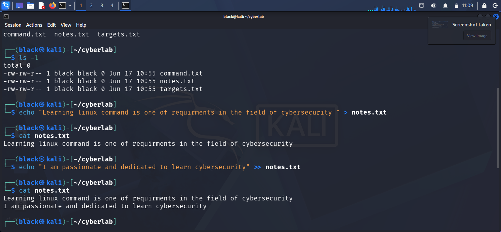
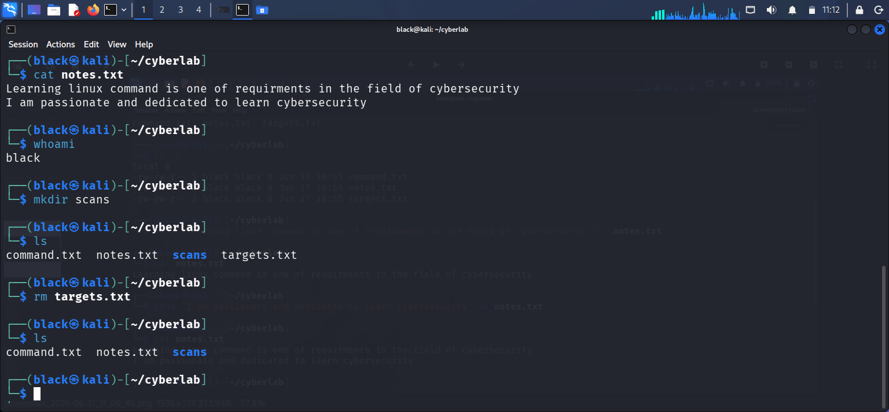

# LinkedIn Visibility Engagement Report

## Objective

The objective of this project was to improve the visibility of my LinkedIn profile and measure engagement.

## LinkedIn Profile

https://www.linkedin.com/in/innocent-shivachi/

## Screenshot 1

### What I Did

I optimized my LinkedIn profile by updating the headline and profile information.

### Why I Did It

Recruiters often search using keywords. Optimizing the profile helps improve visibility.

---

## Screenshot 2

### What Happened

The profile received increased visibility and engagement.

### Evidence

The screenshot above shows the engagement metrics.

---

## Lessons Learned

- Consistent posting increases visibility.
- Using cybersecurity keywords helps recruiters find your profile.
- Professional networking can create opportunities.
