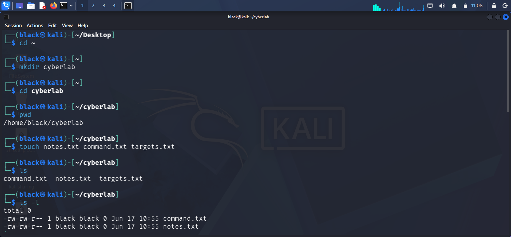

# LinkedIn Visibility Engagement Report

## Objective

The objective of this project was to improve my LinkedIn visibility and track engagement metrics.

## LinkedIn Profile

[My LinkedIn Profile](https://www.linkedin.com/in/innocent-shivachi/)

## Screenshot 1

I uploaded a post and monitored the engagement.

## What I Did

I optimized my profile and shared content related to cybersecurity.

## Results

The profile received increased visibility and engagement.

## Lessons Learned

Consistent posting and profile optimization improve visibility.
